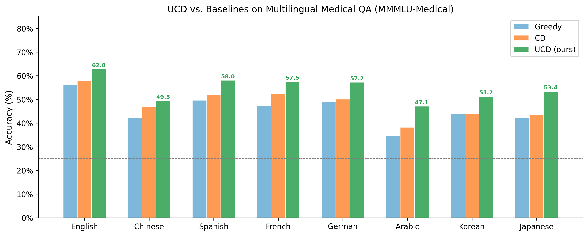
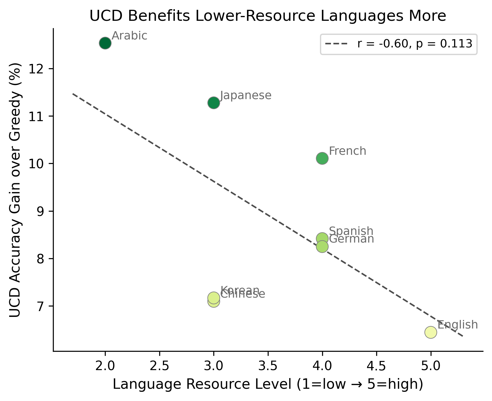
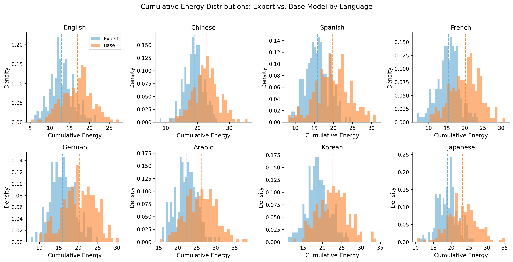
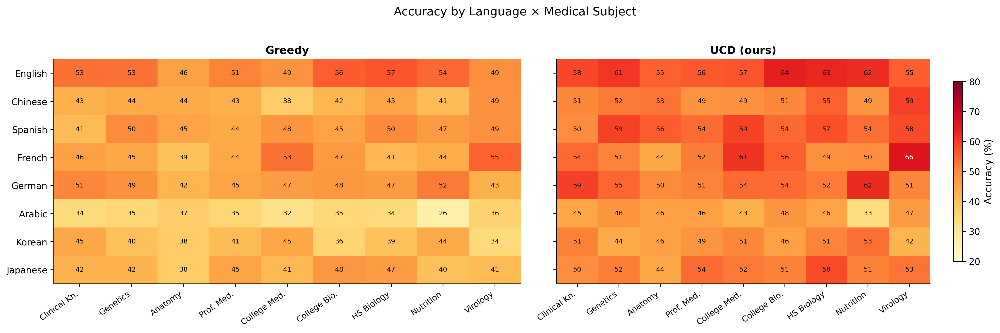
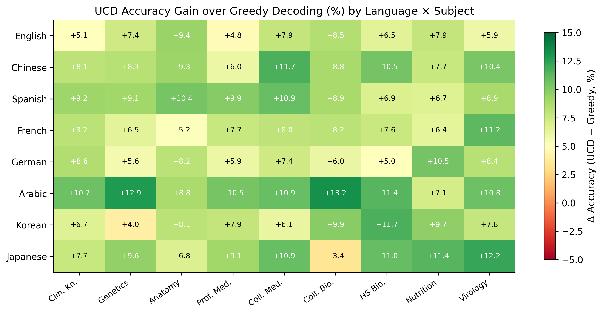

# UCD-Multilingual-Medical

**Extending Uncertainty-Aware Contrastive Decoding to Multilingual Medical QA**

A reproduction and cross-lingual extension of:

> **Uncertainty-Aware Contrastive Decoding**  
> Hakyung Lee\*, Subeen Park\*, Joowang Kim, Sungjun Lim, Kyungwoo Song  
> *Findings of ACL 2025*  
> 📄 [Paper (ACL Anthology)](https://aclanthology.org/2025.findings-acl.1352)  
> 💻 [Original code (MLAI-Yonsei/UCD)](https://github.com/MLAI-Yonsei/UCD)  
> 📎 [Local PDF copy](paper/UCD_Lee_et_al_2025.pdf)

---

## Motivation

The original UCD paper evaluated exclusively on English datasets (TruthfulQA, BioASQ, MMLU reasoning benchmarks). The authors explicitly note in their limitations section:

> *"our evaluation was conducted exclusively on English datasets, limiting insights into UCD's applicability across other languages and cultural contexts."*

This repository tests whether UCD's **energy-based dynamic weighting** generalises across languages — with a focus on **multilingual medical QA**, where hallucination has real clinical stakes.

---

## What We Test

| Dimension | Details |
|---|---|
| **Decoding methods** | Greedy · Contrastive Decoding (CD) · UCD (ours) |
| **Languages** | English · Chinese · Spanish · French · German · Arabic · Korean · Japanese |
| **Dataset** | [MMMLU-Medical](https://huggingface.co/datasets/openai/MMMLU) — 1,871 identical questions translated across all 8 languages |
| **Medical subjects** | Clinical Knowledge · Medical Genetics · Anatomy · Professional Medicine · College Medicine · College Biology · HS Biology · Nutrition · Virology |
| **Models (small-scale)** | `Qwen2.5-0.5B` (base) + `Qwen2.5-0.5B-Instruct` (expert) |
| **Models (full-scale)** | `Qwen2.5-7B` + `Qwen2.5-7B-Instruct` · `Meditron-7B` + `LLaMA-2-7B` |

---

## Core Hypothesis

> UCD's uncertainty-aware weighting provides **larger accuracy gains in lower-resource languages**, where baseline models carry higher cumulative uncertainty — making it especially valuable for multilingual medical AI.

---

## Repository Structure

```
ucd-multilingual/
├── paper/
│   └── UCD_Lee_et_al_2025.pdf          # Original paper (Lee et al., ACL 2025)
│
├── scripts/
│   ├── ucd_engine.py                   # UCD implementation (energy, logit trace, weighting)
│   ├── run_fast.py                     # Main experiment runner (all languages × methods)
│   ├── run_experiment.py               # Full configurable runner (argparse, cloud-ready)
│   └── generate_plots.py               # All paper figures + LaTeX table
│
├── configs/
│   └── experiment_0.5B.yaml            # Reproducibility config for 0.5B run
│
├── plots/
│   └── preview/                        # Simulated-data figure previews (layout QC)
│       ├── fig1_accuracy_bars.png
│       ├── fig2_gain_vs_resource.png
│       ├── fig3_energy_distributions.png
│       ├── fig4_subject_heatmap.png
│       └── fig5_ucd_delta_heatmap.png
│
├── results/                            # Populated after running experiments (gitignored)
│
├── requirements.txt
└── README.md
```

---

## Figures (Preview — Simulated Data)

> Real results populate after running the experiment. These previews confirm layout and hypotheses.

### Fig 1 — Accuracy across languages


### Fig 2 — UCD gain vs. language resource level


### Fig 3 — Cumulative energy distributions


### Fig 4 — Language × Subject heatmap


### Fig 5 — UCD Δ accuracy over greedy


---

## Quickstart

### 1. Install dependencies

```bash
pip install -r requirements.txt
```

### 2. Run experiment (local, small models)

```bash
# Runs Qwen2.5-0.5B-Instruct (expert) + Qwen2.5-0.5B (base)
# on 150 samples × 8 languages ≈ 5 min on Apple M1 MPS
python scripts/run_fast.py
```

Results are saved to `results/records_0.5B_n150.json` and `results/summary_0.5B_n150.json`.

### 3. Run experiment (cloud / full scale)

```bash
# 7B models, 500 samples per language — requires A100/H100
python scripts/run_experiment.py \
    --model_size 7B \
    --n_samples 500 \
    --output_dir results/ \
    --languages en zh es fr de ar ko ja
```

### 4. Generate plots

```bash
# From real results
python scripts/generate_plots.py --results_dir results/ --output_dir plots/

# Preview with simulated data (no models needed)
python scripts/generate_plots.py --simulate --output_dir plots/preview/
```

---

## UCD Method (Summary)

UCD dynamically reweights an **expert model** (EXP) and **base model** (BASE) at each decoding step using a cumulative energy function:

$$\text{Energy}(\mathbf{z}_t, \ell_t) = T \log \sum_{v \in \mathcal{V}} \exp\!\left(\frac{z_t[v] + \ell_t}{T}\right)$$

where the logit trace $\ell_t = \beta \cdot \ell_{t-1} + \mathbf{z}_{t}^{(M)}[\hat{x}_{t-1}]$ accumulates historical confidence.

Per-timestep weights are energy-normalised:

$$w_t^{(M)} = \frac{E_t^{(M)}}{E_t^{\text{EXP}} + E_t^{\text{BASE}}}$$

The UCD logit vector is then:

$$\mathbf{z}_t^{\text{UCD}}[v] = 2\, w_t^{\text{EXP}}\, z_t^{\text{EXP}}[v] - w_t^{\text{BASE}}\, z_t^{\text{BASE}}[v]$$

This extension applies UCD to **multilingual multiple-choice evaluation** by scoring answer tokens {A, B, C, D} at the answer position, with the logit trace built over question tokens.

---

## Planned Experiments

- [x] Dataset pipeline (MMMLU-Medical, 8 languages)
- [x] UCD engine implementation
- [x] Small-scale runner (0.5B, MPS/CPU)
- [x] Full-scale runner (7B, cloud-ready)
- [x] Plot generation (5 figures + LaTeX table)
- [ ] Run 0.5B experiments (local)
- [ ] Run 7B experiments (cloud)
- [ ] MedQA EN/ZH comparison (USMLE format)
- [ ] HEAD-QA Spanish analysis
- [ ] Energy calibration analysis across languages

---

## Citation

If you use this work, please also cite the original UCD paper:

```bibtex
@inproceedings{lee-etal-2025-uncertainty,
    title     = "Uncertainty-Aware Contrastive Decoding",
    author    = "Lee, Hakyung and Park, Subeen and Kim, Joowang and Lim, Sungjun and Song, Kyungwoo",
    booktitle = "Findings of the Association for Computational Linguistics: ACL 2025",
    year      = "2025",
    publisher = "Association for Computational Linguistics",
}
```

---

## License

Code: MIT. The included paper PDF ([`paper/UCD_Lee_et_al_2025.pdf`](paper/UCD_Lee_et_al_2025.pdf)) is © the original authors and ACL; included here for research reference only.
